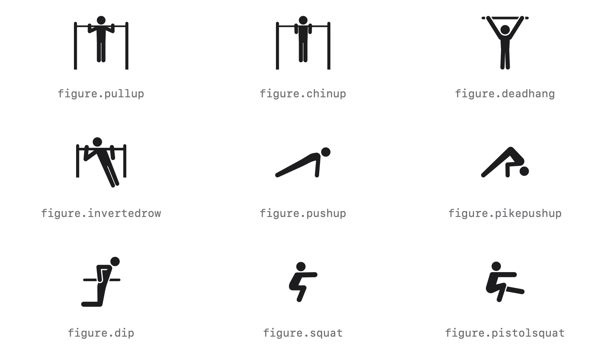
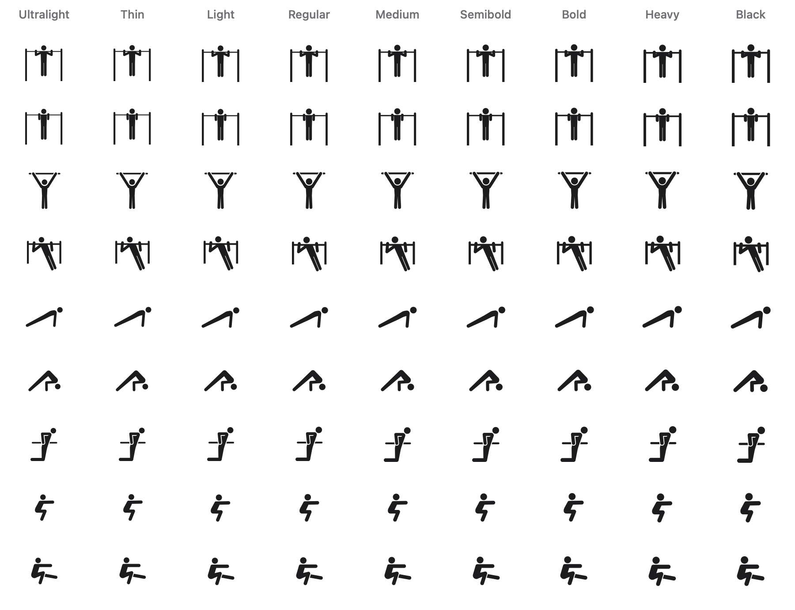

# Calisthenics Symbols

Custom SF Symbols for the calisthenics exercises Apple doesn't ship: pull-up, chin-up, dead hang, inverted row, push-up, pike push-up, dip, squat and pistol squat.

They're drawn to sit alongside Apple's `figure.*` symbols. Each one has Ultralight, Regular and Black masters, so it follows the font weight and Dynamic Type, and lines up with text the way an SF Symbol does.

<picture>
  <source media="(prefers-color-scheme: dark)" srcset="docs/symbols-dark.png">
  
</picture>

## Weights

All nine weights, from Ultralight to Black:

<picture>
  <source media="(prefers-color-scheme: dark)" srcset="docs/weights-dark.png">
  
</picture>

## Installation

### Swift Package Manager

In Xcode, choose **File › Add Package Dependencies…** and enter:

```
https://github.com/MorusPatre/CalisthenicsSymbols
```

Or add it to `Package.swift`:

```swift
.package(url: "https://github.com/MorusPatre/CalisthenicsSymbols.git", from: "1.0.0")
```

### Copying the symbols

You don't need the package to use the symbols. Drag the `.symbolset` folders from [`Sources/CalisthenicsSymbols/Resources/Symbols.xcassets`](Sources/CalisthenicsSymbols/Resources/Symbols.xcassets) into your app's asset catalog, then load them by name:

```swift
Image("figure.pullup")
```

Each folder holds the symbol's SVG template, which you can also import into the SF Symbols app to edit it or export it.

## Usage

```swift
import CalisthenicsSymbols

// VoiceOver reads "Pull-up".
Image(.pullUp)

// VoiceOver skips it, for when the exercise name is right beside it.
Label {
    Text("Pull-ups")
} icon: {
    Image(decorative: .pullUp)
}

// Weight, size and colour work like any SF Symbol.
Image(.squat)
    .font(.title.weight(.semibold))
    .foregroundStyle(.tint)
```

UIKit and AppKit:

```swift
let image = UIImage(.dip, withConfiguration: UIImage.SymbolConfiguration(textStyle: .headline))
let image = NSImage(.dip) // macOS 13 and later
```

Or by name, from the package's bundle:

```swift
Image(CalisthenicsSymbol.pistolSquat.name, bundle: CalisthenicsSymbol.bundle)
```

## Symbols

| Case | Name | Shows |
| --- | --- | --- |
| `.pullUp` | `figure.pullup` | Pull-up on a bar between two uprights |
| `.chinUp` | `figure.chinup` | Chin-up on the same bar, hands closer together |
| `.deadHang` | `figure.deadhang` | Hanging from a bar, arms straight |
| `.invertedRow` | `figure.invertedrow` | Inverted row on a bar between two uprights |
| `.pushUp` | `figure.pushup` | Push-up in profile |
| `.pikePushUp` | `figure.pikepushup` | Bottom of a pike push-up, hips high |
| `.dip` | `figure.dip` | Bottom of a dip, hands on the bar |
| `.squat` | `figure.squat` | Squat with arms held forward |
| `.pistolSquat` | `figure.pistolsquat` | Single-leg squat with the free leg held forward |

## Requirements

iOS 15, macOS 12, tvOS 15, watchOS 8 or visionOS 1, and Xcode 15 or later.

## Previews

The images above are drawn by the system's own symbol renderer from the compiled asset catalog, so they match what an app shows. To redraw them after changing a symbol, run this from the repository root:

```sh
swift Scripts/render-previews.swift
```

## License

[MIT](LICENSE). You can use the symbols in any app, commercial or not.

Because the symbols are designed to look like SF Symbols, don't use them in app icons, logos or other trademark-related use. Apple's SF Symbols terms restrict SF Symbols, and glyphs that are substantially or confusingly similar to them, in those uses.

This project isn't affiliated with Apple. SF Symbols is a trademark of Apple Inc.
